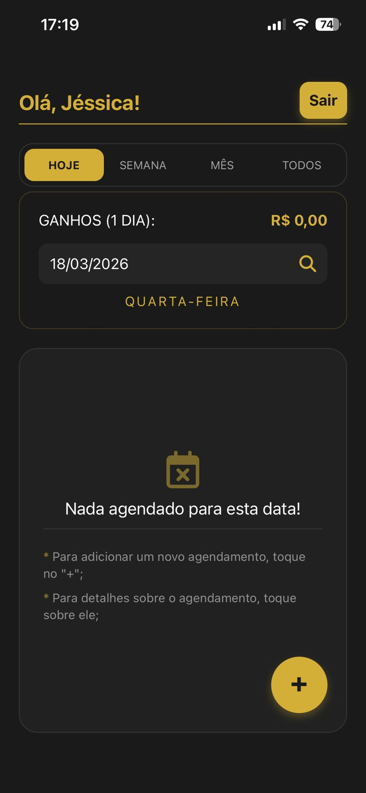

# Agenda para manicure

## 📋 Descrição

Esta interface foi projetada para oferecer agilidade e controle total sobre a rotina de atendimento. Focada na experiência da manicure, a tela de Novo Agendamento elimina processos manuais e organiza as informações essenciais em um único fluxo intuitivo.

## 🚀 Funcionalidades
- **Gestão de Agendamentos:** Cadastro de clientes com data e hora.
- **Filtros Inteligentes:** Visualização por Hoje, Semana e Mês.
- **Cálculo de Ganhos:** Soma automática de serviços (Mão/Pé) por período selecionado.
- **Segurança:** Autenticação individual por manicure via JWT.

## 🛠️ Tecnologias

- Node.js / Express
- JSON Web Token (JWT)
- React.native (Expo)
- MongoDB (Mongoose)

## 📱 Imagem do projeto
   

  

